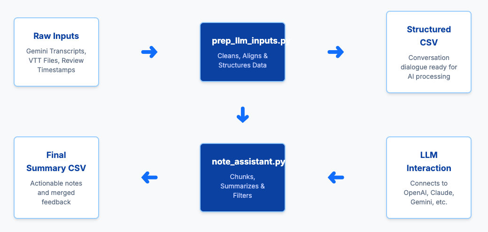

# Dailies Note Assistant

## Introduction

An experimental Python toolkit for processing artist review sessions and generating AI-powered summaries.

## Disclaimers

- This is experimental code. Not recommended for production usage yet. Use it to evaluate this approach and explore similar ideas.
- No support is currently provided by Sony Pictures Imageworks for using these tools in production. Use this at your own risk.
- As a meta experiment, most of the code as well as documentation you see here is generated by AI also (Gemini Code Assist/Claude), so developer beware!

## Assumptions

- We are assuming that there is a recording of the review meeting along with transcript
- Currently code assumes Google Meet transcript, but can be adopted for other vendors (Zoom/Teams etc)
- Tool is intended for offline meeting summary generation, not real time (e.g meeting assistants that join as a participant and generate summaries on the fly)

## Overview

This toolkit consists of two main components that work together to transform raw review meeting transcripts into structured, actionable summaries:

1. **`prep_llm_inputs.py`** - Processes and structures raw meeting transcripts
2. **`note_assistant.py`** - Generates AI-powered summaries using Large Language Models

## Quick Start

### Installation

```bash
# Clone or download the repository
git clone https://github.com/AcademySoftwareFoundation/dna.git
cd experimental/spi/note_assistant

# Install required dependencies
pip install pandas requests tqdm openai anthropic google-generativeai python-dotenv
```

### Environment Setup

Create a `.env` file with your API keys:

```env
OPENAI_API_KEY=your_openai_api_key_here
CLAUDE_API_KEY=your_claude_api_key_here
GOOGLE_API_KEY=your_google_api_key_here
```

### Basic Workflow

```bash
# Step 1: Process raw transcript
python prep_llm_inputs.py --gemini_transcript meeting.txt conversations.csv

# Step 2: Generate AI summaries
python note_assistant.py conversations.csv summaries.csv --provider claude --verbose
```

## System Architecture

The processing pipeline follows this workflow:

```
Raw Meeting Data → prep_llm_inputs.py → Structured CSV → note_assistant.py → AI Summaries
```

### Input Sources

- **Gemini Transcripts**: Primary transcript source with speaker identification
- **Whisper VTT Files**: Optional for improved timestamp accuracy
- **Review Timestamps**: Optional for associating dialogue with specific review items

### Output Products

- **Structured Conversations**: CSV files with speaker-identified dialogue
- **AI-Generated Summaries**: Concise, actionable meeting notes
- **Process Logs**: Detailed processing information for debugging

## Component Details

### prep_llm_inputs.py

**Purpose**: Converts raw meeting transcripts into structured data suitable for LLM analysis

**Key Features**:
- Multi-source transcript processing (Gemini + Whisper alignment)
- Timestamp alignment and correction
- Speaker name normalization (full names → initials)
- Review segment association
- Dialogue aggregation by topic/timeframe

**Input Formats**:
- Gemini transcript files (with date/time headers)
- Whisper VTT files (standard WebVTT format)
- Review timestamp files (custom format for shot/version tracking)

**Output**: CSV file with columns: `timestamp`, `shot/id`, `conversation`

See detailed documentation: [prep_llm_inputs](docs/prep_llm_inputs.md)

### note_assistant.py

**Purpose**: Generates AI-powered summaries from structured conversation data

**Key Features**:
- Multi-LLM support (OpenAI, Claude, Gemini, Ollama)
- Intelligent conversation chunking
- Response caching system
- Shot/topic filtering capabilities
- Production notes integration

**Input**: CSV file from `prep_llm_inputs.py` or similar structure
**Output**: CSV file with AI-generated summaries and metadata

## Supported LLM Providers

| Provider | Models | API Required | Local |
|----------|--------|--------------|-------|
| OpenAI | GPT-3.5, GPT-4, GPT-4o | Yes | No |
| Anthropic Claude | Claude-3 variants | Yes | No |
| Google Gemini | Gemini models | Yes | No |
| Ollama | Llama, Mistral, etc. | No | Yes |

See detailed documentation: [note_assistant](docs/note_assistant.md)

## Use Cases

### Creative Review Meetings
- **Film/Animation Studios**: Review dailies, shots, and creative iterations
- **Game Development**: Asset reviews, level design feedback
- **Advertising Agencies**: Campaign reviews, creative presentations

## Configuration Options

### Chunking Parameters

Control how conversations are split for LLM processing:

```bash
--max-chars 8000        # Maximum characters per chunk
--overlap-chars 1000    # Character overlap between chunks
```

### Processing Modes

- **Standard Mode**: Full transcript → AI summary pipeline
- **Pre-processing Mode**: Inspect chunking without LLM calls
- **Cached Mode**: Reuse previous LLM responses
- **Filtered Mode**: Process only specific shots/topics

### Quality Controls

- **Speaker Normalization**: Consistent speaker identification
- **Timestamp Validation**: Prevents timeline inconsistencies
- **Error Recovery**: Continues processing despite individual failures

## Performance Optimization

### Cost Management
- **Caching**: Save/reuse LLM responses to avoid redundant API calls
- **Filtering**: Process only relevant conversations
- **Model Selection**: Balance cost vs. quality based on needs

### Processing Efficiency
- **Chunking Strategy**: Optimize for LLM context windows
- **Batch Processing**: Group related conversations
- **Parallel Processing**: Handle multiple files simultaneously

### Quality Assurance
- **Verbose Logging**: Detailed processing information
- **Validation Checks**: Input format verification
- **Error Reporting**: Comprehensive error tracking

## Data Flow Diagram

```
┌─────────────────┐    ┌─────────────────┐    ┌─────────────────┐
│   Raw Meeting   │    │     Optional    │    │   Review Item   │
│   Transcript    │    │   Whisper VTT   │    │   Timestamps    │
│  (Gemini/etc.)  │    │      File       │    │     (Shot/      │
└─────────┬───────┘    └─────────┬───────┘    │    Version)     │
          │                      │            └─────────┬───────┘
          │                      │                      │
          └──────────────────────┼──────────────────────┘
                                 │
                    ┌────────────▼────────────┐
                    │                         │
                    │   prep_llm_inputs.py    │
                    │                         │
                    │  • Parse transcripts    │
                    │  • Align timestamps     │
                    │  • Normalize speakers   │
                    │  • Group by segments    │
                    │                         │
                    └────────────┬────────────┘
                                 │
                    ┌────────────▼────────────┐
                    │                         │
                    │   Structured CSV        │
                    │                         │
                    │  timestamp | shot/id |  │
                    │  conversation          │
                    │                         │
                    └────────────┬────────────┘
                                 │
                    ┌────────────▼────────────┐
                    │                         │
                    │   note_assistant.py     │
                    │                         │
                    │  • Chunk conversations  │
                    │  • Call LLM APIs        │
                    │  • Parse responses      │
                    │  • Generate summaries   │
                    │                         │
                    └────────────┬────────────┘
                                 │
              ┌──────────────────┼──────────────────┐
              │                  │                  │
    ┌─────────▼──────────┐ ┌─────▼──────┐ ┌────────▼────────┐
    │                    │ │            │ │                 │
    │  AI-Generated      │ │  Process   │ │   Cache Files   │
    │   Summaries        │ │    Logs    │ │  (Optional)     │
    │      (CSV)         │ │            │ │                 │
    │                    │ │            │ │                 │
    └────────────────────┘ └────────────┘ └─────────────────┘
```


## Integration Examples

### Basic Processing Pipeline

```bash
#!/bin/bash
# process_meeting.sh

MEETING_FILE="$1"
OUTPUT_DIR="output"
mkdir -p "$OUTPUT_DIR"

echo "Processing transcript: $MEETING_FILE"

# Step 1: Structure the transcript
python prep_llm_inputs.py \
  --gemini_transcript "$MEETING_FILE" \
  "$OUTPUT_DIR/conversations.csv"

# Step 2: Generate summaries
python note_assistant.py \
  "$OUTPUT_DIR/conversations.csv" \
  "$OUTPUT_DIR/summaries.csv" \
  --provider claude \
  --verbose \
  --output-llm-response "$OUTPUT_DIR/llm_cache.csv"

echo "Processing complete. Results in $OUTPUT_DIR/"
```

### Advanced Processing with All Features

```bash
# Full-featured processing
python prep_llm_inputs.py \
  --gemini_transcript daily_review_2024_01_15.txt \
  --vtt whisper_output.vtt \
  --review_timestamps shot_reviews.txt \
  structured_conversations.csv

python note_assistant.py \
  structured_conversations.csv \
  final_summaries.csv \
  --provider claude \
  --model claude-3-sonnet-20240229 \
  --max-chars 6000 \
  --overlap-chars 800 \
  --review-csv priority_shots.csv \
  --output-llm-response response_cache.csv \
  --verbose
```

### Creating VTT files

```bash
pip install openai-whisper
whisper "your_meeting_recording.mp4" --model medium --output_format vtt --output_dir "output_vtt_files"
```
### Creating Review Timestamp files

You may need to write some custom review tool plugin to create review timestamp file to get better data on when specific shots were reviewed during the meeting. Here is an example OpenRV plugin for reference: https://github.com/richardssam/RvOtioEvents

## Troubleshooting

### Common Issues

**File Format Problems**
- Ensure Gemini transcripts start with date/time line
- Verify "Transcript" marker exists in transcript files
- Check VTT files are valid WebVTT format

**Processing Errors**
- Use `--verbose` flag for detailed error information
- Check API keys are correctly set in `.env` file
- Verify input CSV has required columns: `shot/id`, `conversation`

**Performance Issues**
- Adjust `--max-chars` based on LLM context limits
- Use caching to avoid redundant API calls
- Filter processing with `--review` for specific shots only

### Debug Workflows

```bash
# 1. Test transcript parsing only
python prep_llm_inputs.py --gemini_transcript test.txt output.csv

# 2. Preview chunking without LLM calls
python note_assistant.py input.csv preview.csv --pre-process

# 3. Test with cached responses
python note_assistant.py input.csv output.csv --input-llm-response cache.csv
```

## Best Practices

### Input Preparation
- Ensure consistent transcript formatting
- Validate timestamp sequences
- Check speaker name consistency

### Processing Strategy
- Start with small test datasets
- Use pre-processing mode to optimize chunk sizes
- Cache LLM responses for iterative refinement

### Quality Control
- Review AI summaries for accuracy
- Adjust prompts based on output quality
- Maintain speaker identification consistency

## Extending the Suite

### Adding New LLM Providers
1. Implement provider-specific API calls in `note_assistant.py`
2. Add authentication handling
3. Update command-line options

### Custom Input Formats
1. Extend parsing logic in `prep_llm_inputs.py`
2. Add format validation
3. Update documentation

### Integration Hooks
- Add webhook support for real-time processing
- Implement database storage backends
- Create REST API endpoints

## Support

For issues, questions, or feature requests:
- Create an issue in the repository
- Check troubleshooting section above
- Review component-specific documentation

---
