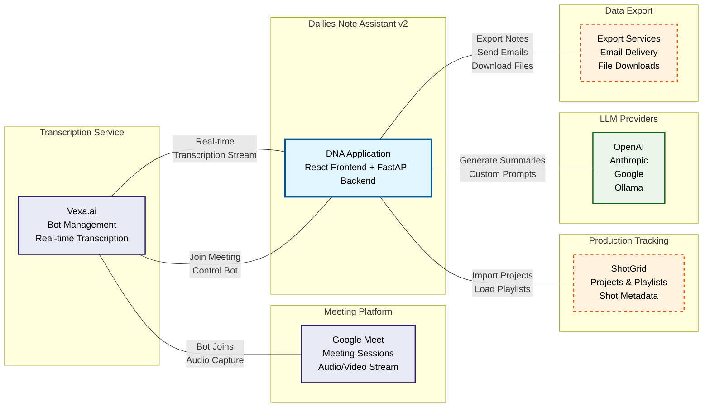
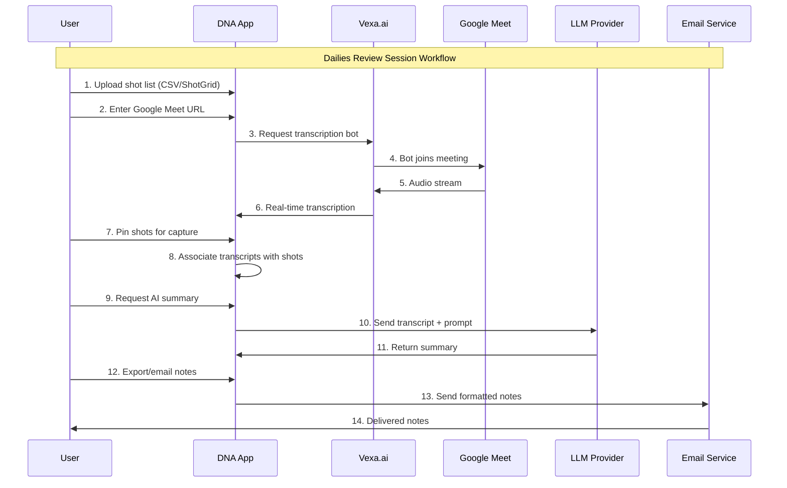

# System Architecture Diagram

## Dailies Note Assistant v2 - High-Level System Overview



## System Integration Flow



## External Service Dependencies

```
┌─────────────────────────────────────────────────────────────────────────────────────┐
│                                    USER INTERFACE                                   │
├─────────────────────────────────────────────────────────────────────────────────────┤
│                          React Frontend (Vite) - Port 5173                         │
│  ┌─────────────────┐  ┌─────────────────┐  ┌─────────────────┐  ┌─────────────────┐ │
│  │   Shot List     │  │   Meeting       │  │  Transcription  │  │   Summary       │ │
│  │   Management    │  │   Integration   │  │    Capture      │  │   Generation    │ │
│  │                 │  │                 │  │                 │  │                 │ │
│  │ • CSV Upload    │  │ • Google Meet   │  │ • Pin Shots     │  │ • LLM Models    │ │
│  │ • ShotGrid      │  │   Join/Leave    │  │ • Live Stream   │  │ • Custom        │ │
│  │   Integration   │  │ • Bot Control   │  │ • WebSocket     │  │   Prompts       │ │
│  └─────────────────┘  └─────────────────┘  └─────────────────┘  └─────────────────┘ │
└─────────────────────────────────────────────────────────────────────────────────────┘
                                        │
                              HTTP/WebSocket API Calls
                                        │
┌─────────────────────────────────────────────────────────────────────────────────────┐
│                                BACKEND SERVICES                                     │
├─────────────────────────────────────────────────────────────────────────────────────┤
│                         FastAPI Backend - Port 8000                                │
│                                                                                     │
│  ┌─────────────────┐  ┌─────────────────┐  ┌─────────────────┐  ┌─────────────────┐ │
│  │   API Gateway   │  │   WebSocket     │  │   File          │  │   Email         │ │
│  │   & Routing     │  │   Handler       │  │   Processing    │  │   Service       │ │
│  │                 │  │                 │  │                 │  │                 │ │
│  │ • REST Endpoints│  │ • Real-time     │  │ • CSV Parser    │  │ • Gmail API     │ │
│  │ • CORS Config   │  │   Transcription │  │ • Data Export   │  │ • SMTP Server   │ │
│  │ • Middleware    │  │ • Shot Pinning  │  │ • File Download │  │ • Note Sending  │ │
│  └─────────────────┘  └─────────────────┘  └─────────────────┘  └─────────────────┘ │
│                                                                                     │
│  ┌─────────────────┐  ┌─────────────────┐  ┌─────────────────┐  ┌─────────────────┐ │
│  │   LLM Service   │  │   ShotGrid      │  │   Vexa Proxy    │  │   Config        │ │
│  │   Manager       │  │   Integration   │  │   (Optional)    │  │   Manager       │ │
│  │                 │  │                 │  │                 │  │                 │ │
│  │ • Model Config  │  │ • Project Data  │  │ • API Routing   │  │ • YAML Config   │ │
│  │ • Prompt System │  │ • Playlist Mgmt │  │ • CORS Bypass   │  │ • Demo Mode     │ │
│  │ • Summary Gen   │  │ • Demo Mode     │  │ • WebSocket     │  │ • Environment   │ │
│  └─────────────────┘  └─────────────────┘  └─────────────────┘  └─────────────────┘ │
└─────────────────────────────────────────────────────────────────────────────────────┘
                                        │
                              External API Integrations
                                        │
┌─────────────────────────────────────────────────────────────────────────────────────┐
│                              EXTERNAL SERVICES                                     │
├─────────────────────────────────────────────────────────────────────────────────────┤
│                                                                                     │
│  ┌─────────────────┐  ┌─────────────────┐  ┌─────────────────┐  ┌─────────────────┐ │
│  │    Vexa.ai      │  │   LLM Providers │  │    ShotGrid     │  │   Email         │ │
│  │   Bot Service   │  │                 │  │     API         │  │   Services      │ │
│  │                 │  │                 │  │                 │  │                 │ │
│  │ • Google Meet   │  │ • OpenAI GPT    │  │ • Project Data  │  │ • Gmail API     │ │
│  │   Bot Control   │  │ • Claude        │  │ • Playlists     │  │ • SMTP Servers  │ │
│  │ • Audio Stream  │  │ • Gemini        │  │ • Shot/Version  │  │ • Note Delivery │ │
│  │ • Transcription │  │ • Ollama (local)│  │   Metadata      │  │                 │ │
│  │ • WebSocket     │  │                 │  │                 │  │                 │ │
│  └─────────────────┘  └─────────────────┘  └─────────────────┘  └─────────────────┘ │
│                                                                                     │
│  ┌─────────────────┐                                          ┌─────────────────┐ │
│  │  Google Meet    │                                          │   LLM Backend   │ │
│  │   Sessions      │                                          │   (Optional)    │ │
│  │                 │                                          │                 │ │
│  │ • Meeting Rooms │                                          │ • Remote LLM    │ │
│  │ • Audio Stream  │                                          │   Processing    │ │
│  │ • Participants  │                                          │ • Load Balancing│ │
│  └─────────────────┘                                          └─────────────────┘ │
└─────────────────────────────────────────────────────────────────────────────────────┘
```

## Key Integration Points

### Required Services
- **Vexa.ai**: Core transcription service that manages Google Meet bots
- **Google Meet**: Meeting platform where audio is captured

### Optional Services  
- **LLM Providers**: AI summary generation (OpenAI, Anthropic, Google, Ollama)
- **ShotGrid**: Production tracking system for shot/playlist data
- **Email Services**: Note distribution via Gmail API or SMTP
- **File System**: CSV import/export for shot lists and notes

### Service Communication Patterns
- **Real-time**: WebSocket connection with Vexa.ai for live transcription
- **API Calls**: REST endpoints for LLM summaries, ShotGrid data, email sending
- **File Operations**: Local file system for CSV upload/download
- **Authentication**: OAuth for Gmail, API keys for LLM providers, script auth for ShotGrid